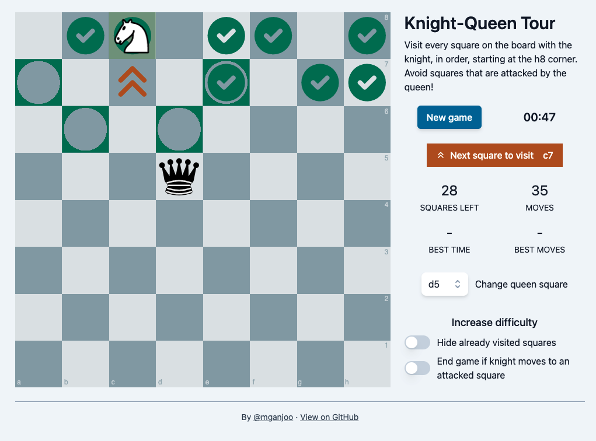
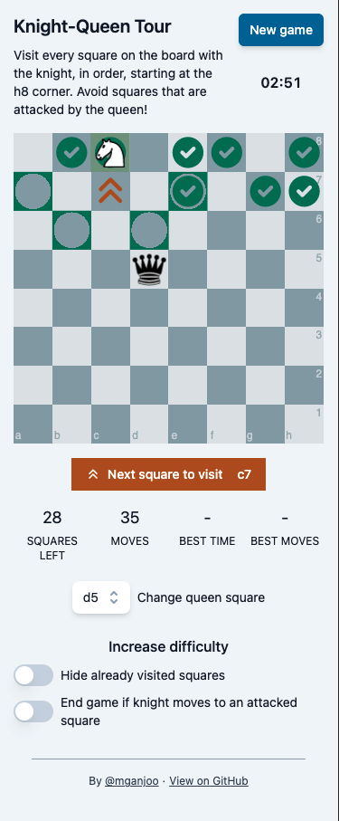

# Knight-Queen Tour Puzzle

This is an implementation of a visualization puzzle that helps build intuition
for knight movement. I first heard of this puzzle in
[one of Ben Finegold's videos](https://www.youtube.com/watch?v=SrQlpY_eGYU).

The puzzle is set up with a knight and an opposing queen on a central square.
The goal is to maneuver the knight around the queen and visit _every_ square on
the board except the ones attacked by the queen. I've found this to be super
challenging, but also very educational.

As far as I could tell, there isn't an app that presents this puzzle with an
interactive board (the best option seems to be to use the Board Editor on
Lichess or Chess.com and manually set up the puzzle). This app shows which
square the knight should target, and also alerts in case the knight is moved
onto an attacked square.

## App demo

The app is deployed to https://knights-tour-game.vercel.app/.

## Screenshots

## Underlying libraries

This app uses [Chessground](https://github.com/ornicar/chessground) for the
board UI and [Tailwind](https://tailwindcss.com/) for styling. For knight move
generation and queen attack detection, I wrote some simple
[0x88 move representation logic](https://www.chessprogramming.org/0x88) as an
exercise (using the excellent [chess.js](https://github.com/jhlywa/chess.js)
library as a reference).

## Running the project locally

### `npm start`

Runs the app in the development mode.\
Open [http://localhost:3000](http://localhost:3000) to view it in the browser.

The page will reload if you make edits.\
You will also see any lint errors in the console.

### `npm run inspect`

Runs the app (like `npm start`) but with
[XState Inspector](https://xstate.js.org/docs/packages/xstate-inspect) enabled.

### `npm test`

Launches the test runner in the interactive watch mode.

### `npm run build`

Builds the app for production to the `build` folder.
